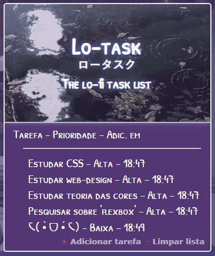

# Sobre
Repositório criado pra compartilhar alguns estudos que fiz e tenho feito com foco em HTML, CSS e JavaScript.

***

# Projetos de estudo

  <a href="https://jjuniorbrasil.github.io/projetinhos-front/Lo-task/">
     
    Lo-Task
  </a>

11/fev/23 - Primeiro *projeto*. Feito em poucas horas, é uma lista que registra tarefas com grau de importância e o horário em que são adicionadas. Não tem nada complexo e **só é estéticamente aceitável em navegadores desktop**, pois não tem nenhum *media querie*. Foi proveitoso apenas pra fixar alguns conceitos, tags e propriedades simples na cabeça.

***
